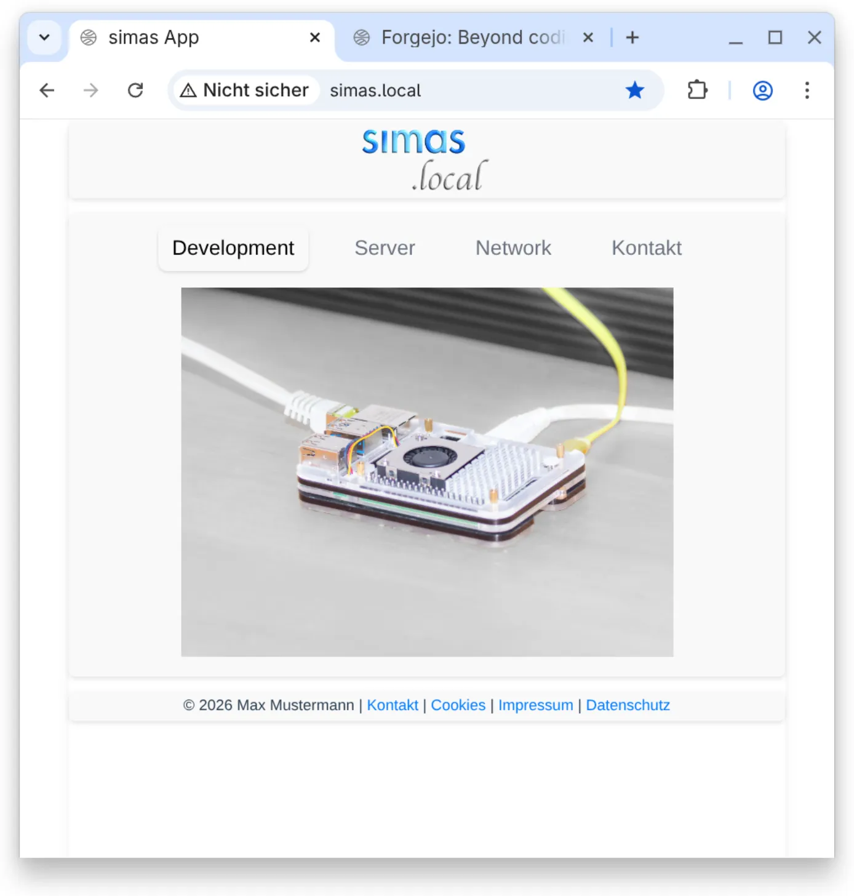
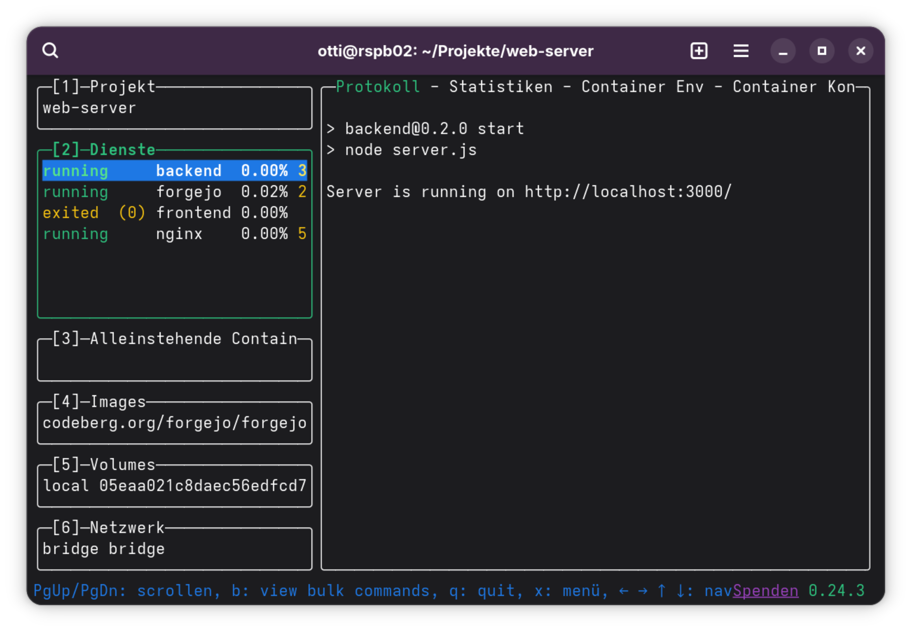

# Web-Server

Ein Server Stack mit Docker Compose:

* **Frontend:** Vue.js (wird im Container gebaut)
* **Backend:** Node.js API
* **Git-Server:** Forgejo
* **Webserver:** Nginx (liefert statische Dateien aus)

<div align="center">

Web Services `simas.local` und `git.simas.local` |
:-------------------------:|
 | 

</div>

## Voraussetzungen

### Auf dem Entwicklungsrechner

Installieren:

* `git` (Versionierung)
* `nodejs` und `npm` (Verwaltung der Abhängigkeiten und `package-lock.json`)
* Docker & Docker Compose (optional für lokales Testen)

### Auf dem Produktionsrechner (Raspberry Pi 5)

Installieren:

* `git`
* Docker
* Docker Compose Plugin

## DNS und Host-Einstellungen

Damit die Dienste unter den lokalen Domains erreichbar sind, muss die Datei `/etc/hosts` (oder unter Windows `C:\Windows\System32\drivers\etc\hosts`) auf dem Client-Rechner angepasst werden.

Die IP-Adresse des Raspberry Pi (z.B. `192.168.2.126`) eintragen:

```text
192.168.2.126   simas.local
192.168.2.126   git.simas.local
```

dem Server-Rechner weil der ja auch `git` Client sein soll:

```text
127.0.0.1   git.simas.local
```

## SSH Einrichtung für Git

Für die Verbindung zum Git-Server ohne Passwort:

### 1. SSH-Schlüssel generieren (falls nicht vorhanden)

Schlüsselpaar erzeugen:

```bash
ssh-keygen -t ed25519 -C "deine-email@beispiel.de"
```
Den Standardpfad bestätigen (meist `~/.ssh/id_ed25519`). Ein Passphrase ist optional, aber empfohlen.

### 2. Public Key im Profil hinterlegen

Inhalt des öffentlichen Schlüssels kopieren:

```bash
cat ~/.ssh/id_ed25519.pub
```

* Login auf `http://git.simas.local`
* Oben rechts auf Avatar -> **Einstellungen** -> **SSH-/GPG-Schlüssel**
* **Schlüssel hinzufügen** wählen und Inhalt einfügen.

### 3. Auf dem `git` Client (Entwicklungsrechner und Server) (`~/.ssh/config`)

Eintrag in `~/.ssh/config`:

```text
Host git.simas.local
  HostName git.simas.local
  User git
  Port 2222
  IdentityFile ~/.ssh/id_ed25519
  # Fügt den Key nach dem ersten erfolgreichen Login automatisch dem Agenten hinzu
  AddKeysToAgent yes
  # macOS spezifisch: Speichert Passphrase dauerhaft im Schlüsselbund
  UseKeychain yes
```

*Hinweis: Der Port 2222 entspricht dem Standard-Mapping des Docker-Containers. Falls im [compose.yml](./web-server/compose.yml) anders definiert, hier anpassen.*

### 4. Schlüssel dem Agent hinzufügen und Passphrase speichern

**macOS:**

Key in den SSH Agenten laden und passpharse in macOS Schlüsselbund sichern:

Terminal fragt: "Enter passphrase": <passphrase> eingeben

```bash
ssh-add --apple-use-keychain ~/.ssh/id_ed25519
```

**Linux:**

1. Passphrase im Keyring sichern

    Voraussetzung: `libsecret-tools` ist installiert.

    Passphrase im Keyring (z.B. Gnome Keyring) hinterlegen, damit SSH darauf zugreifen kann.

    ```bash
    KEY_PATH="$HOME/.ssh/id_ed25519"

    echo "<passphrase>" | secret-tool store \
        --label="Passwort zum Entsperren von: $KEY_PATH" \
        xdg:schema org.freedesktop.Secret.Generic \
        unique "ssh-store:$KEY_PATH"
    ```

2. Key in den SSH Agenten laden

    ```bash
    ssh-add "$KEY_PATH"
    ```

*Hinweis: Durch die Einstellung `AddKeysToAgent yes` in der `~/.ssh/config` (siehe oben) bleibt der Key für die Sitzung im Agenten aktiv.*

### 5. Verbindung prüfen

1. Test: ssh Verbindung zum Server (ohne Git-Befehl):

    ```bash
    ssh -T git.simas.local
    ```

    **Erwartete Ausgabe:**

    ```bash
    Hi there, ...! You've successfully authenticated with the key named ..., but Forgejo does not provide shell access.
    If this is unexpected, please log in with password and setup Forgejo under another user.
    ```

2. Test: vorhandens (privates) Repo `<repo>` von forgejo User `<username>` clonen:

    ```bash
    git clone git@git.simas.local:<username>/<repo>.git
    ```

    oder ohne `git@` (müsste wegen `.ssh\config` Eintrag s.o., jetzt auch funktionieren)

    ```bash
    git clone git.simas.local:<username>/<repo>.git
    ```

    Lokale Identität für das Repo anpassen:

    ```bash
    cd <repo>
    git config user.name "<username>"
    git config user.email "<email-des-forgejo-accounts>"
    ```

## Einfacher Workflow und Deployment per `git`

### 1. Entwicklung (Lokal)

Änderungen am Code oder an Abhängigkeiten lokal vornehmen.

**Abhängigkeiten aktualisieren:**
Bauen des `package-lock.json`. Dies verhindert Fehler beim Bauen auf dem Server.

Für das Backend:

```bash
cd backend
npm install
cd ..

```

Für das Frontend:

```bash
cd frontend
npm install
cd ..
```

Optional: Testen ob der Build lokal durchläuft

```bash
cd frontend
npm run build
cd ..
```

**Änderungen sichern:**
Dateien (inklusive `package-lock.json`) committen und zum Git-Server pushen.

```bash
git add .
git commit -m "Update und Änderungen"
git push
```

### 2. Deployment (Produktion / Raspberry Pi)

Auf dem Server die Änderungen empfangen und die Container neu bauen.

**Aktualisieren und Bauen:**

```bash
cd ~/Projekte/web-server
git pull
```

Aufräumen alter Volumes (für aktualisieren von von asset Daten etc.)

Forgejo-Daten bleiben erhalten, weil sie in einem Bind-Mount liegen.

```bash
docker compose down --volumes
```

Container bauen und starten

```bash
docker compose up -d --build
```

Nach dem Befehl führt der Container `frontend` den Build-Prozess durch und beendet sich. Der Container `nginx` startet anschließend und liefert die erzeugten Dateien aus:

<div align="center">

`lazydocker` Ansicht nach dem Start |
:-------------------------:|
 | 

</div>

