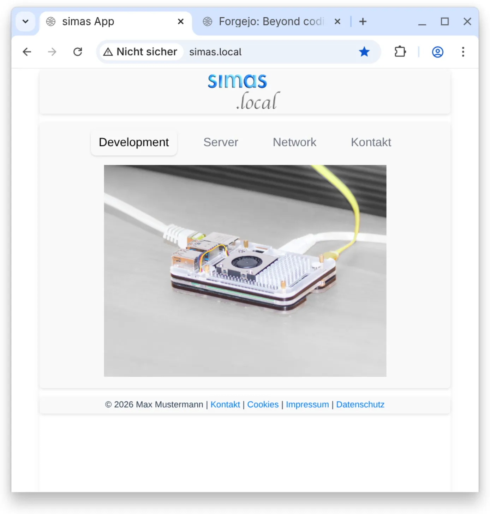
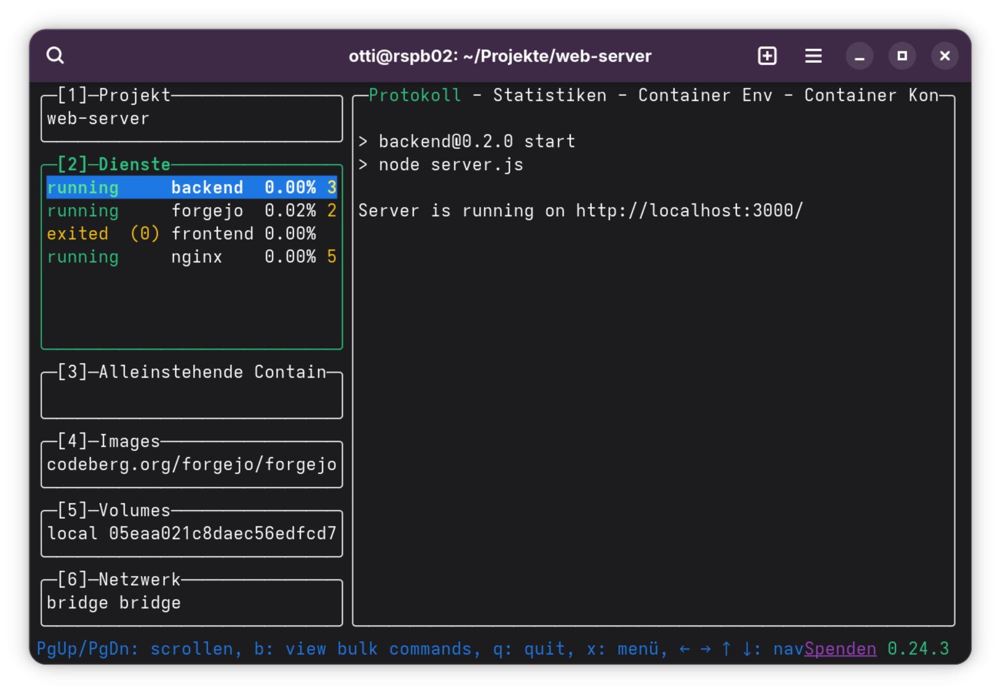

# Web-Server

Ein Server Stack mit Docker Compose:

* **Frontend:** Vue.js (wird im Container gebaut)
* **Backend:** Node.js API
* **Git-Server:** Forgejo
* **Webserver:** Nginx (liefert statische Dateien aus)

<div align="center">

Web Services `simas.local` und `git.simas.local` |
:-------------------------:|
 | 

</div>

## Voraussetzungen

### Auf dem Entwicklungsrechner

Folgende Software muss installiert sein:

* `git` (Versionierung)
* `nodejs` und `npm` (Verwaltung der Abhängigkeiten und `package-lock.json`)
* Docker & Docker Compose (optional für lokales Testen)

### Auf dem Produktionsrechner (Raspberry Pi 5)

Folgende Software muss installiert sein:

* `git`
* Docker
* Docker Compose Plugin

## DNS und Host-Einstellungen

Damit die Dienste unter den lokalen Domains erreichbar sind, muss die Datei `/etc/hosts` (oder unter Windows `C:\Windows\System32\drivers\etc\hosts`) auf dem Client-Rechner angepasst werden.

Die IP-Adresse des Raspberry Pi (z.B. `192.168.2.126`) eintragen:

```text
192.168.2.126   simas.local
192.168.2.126   git.simas.local
```

## Workflow und Deployment

### 1. Entwicklung (Lokal)

Änderungen am Code oder an Abhängigkeiten lokal vornehmen.

**Abhängigkeiten aktualisieren:**
Wichtig für die Generierung einer korrekten `package-lock.json`. Dies verhindert Fehler beim Bauen auf dem Server.

Für das Backend:

```bash
cd backend
npm install
cd ..

```

Für das Frontend:

```bash
cd frontend
npm install
# Optional: Testen ob der Build lokal durchläuft
npm run build
cd ..
```

**Änderungen sichern:**
Dateien (inklusive `package-lock.json`) committen und zum Git-Server pushen.

```bash
git add .
git commit -m "Update und Änderungen"
git push
```

### 2. Deployment (Produktion / Raspberry Pi)

Auf dem Server die Änderungen empfangen und die Container neu bauen.

**Aktualisieren und Bauen:**

```bash
cd ~/Projekte/web-server
git pull

# Aufräumen alter Volumes (Wichtig für Aktualisierung der Frontend-Dateien)
# Achtung: Forgejo-Daten bleiben erhalten, da sie in einem Bind-Mount liegen.
docker compose down --volumes

# Container bauen und im Hintergrund starten
docker compose up -d --build
```

Nach dem Befehl führt der Container `frontend` den Build-Prozess durch und beendet sich. Der Container `nginx` startet anschließend und liefert die erzeugten Dateien aus:

<div align="center">

`lazydocker` Ansicht nach dem Start |
:-------------------------:|
 | 

</div>

