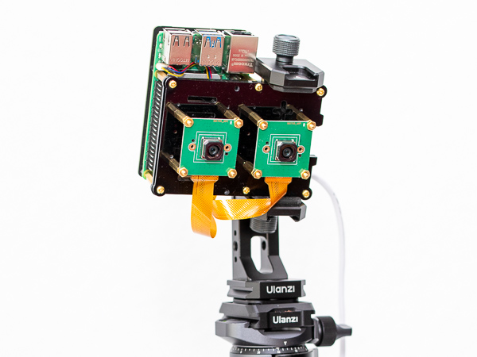
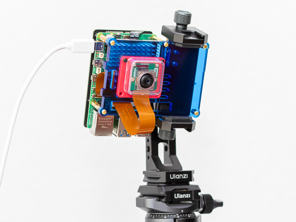

# Raspberry Pi 5 Kamera-Streaming und Bildaufnahme

Skripte für das Streaming und die Aufnahme von Bildern mit den Kameramodulen Innomaker IMX708 und Arducam OwlSight auf einem Raspberry Pi 5. Das Skript sendet Video per UDP an einen Client und speichert Fotos direkt auf dem Pi.

<table align="center">
  <tr>
    <th>Inno Cam und RPi 5 auf Stativ</th>
    <th>Ardu Cam und RPi 5 auf Stativ</th>
  </tr>
  <tr>
    <td align="center">
      
    </td>
    <td align="center">
      
    </td>
  </tr>
</table>

## Plattformen

### Raspberry Pi OS (Server)

- OS: Raspberry Pi OS 13.3 (trixie) aarch64
- Host: Raspberry Pi 5 8GB
- Kernel: Linux 6.12.62+rpt-rpi-2712
- Shell: zsh 5.9

### Linux (Client)

- OS: Debian 13 (Trixie) / Arch Linux
- Shell: zsh 5.9

### macOS (Client)

- OS: macOS Sequoia 15.5 arm64
- Kernel: Darwin 24.5.0
- Shell: zsh 5.9

### Windows 11 (Client)

- OS: Windows 11 Pro x86_64
- Kernel: WIN32_NT 10.0.26100.4202 (24H2)
- Shell: Windows PowerShell 5.1.26100.4202

### Kameramodule

- InnoMaker IMX708 Autofokus - Sensor: IMX708 AF [4608x2592 10-bit RGGB]
- Arducam 64MP OwlSight Autofokus - Sensor: OV64A40 AF [9248x6944 10-bit]

## Funktionen

* Verschiedene Optionen für Video-Streaming:

  * Standard: `rpicam-vid` (UDP).
  * Optional: `gst-launch-1.0` (GStreamer) über die Option `--gst`.
  * Auswahl einer bestimmten GStreamer-Version über `--gstver`.
  * Auswahl vom GStreamer-Protokoll über `--gstprot` (`rtp` oder `mpeg`).
  * Auswahl der Kamera für Stream (`--streamcam`) und Foto (`--stillcam`).
  * Einstellung für Auflösung (`--width`, `--height`) und Framerate (`--framerate`) - siehe [Getestete Modi](#getestete-modi).
  * Vorschau vom Stream auf dem Client mit `ffplay` oder GStreamer.
  * Taste `c` drücken: Foto mit `rpicam-still` aufnehmen und auf dem Pi speichern.
  * Taste `r` drücken: Stream neu starten.

Bei GStreamer erlaubt die Option `--gstver` den Pfad zu einer eigenen `gst-launch-1.0` Datei. Das hilft, wenn man verschiedene Versionen selbst kompiliert hat (siehe [README_CompileRPiGS.md](README_CompileRPiGS.md)).

### Autofokus (Arducam OwlSight)

Der Autofokus der Arducam 64MP OwlSight Kamera arbeitet **eher langsam**. Das System fokussiert:

* **Einmal am Anfang** von jedem Stream.
* Erneut bei jeder **Foto-Aufnahme** mit `rpicam-still`.

Ein Foto mit dieser Kamera zu speichern dauert **lange** (etwa **6–10 Sekunden**).

Manuelle Neufokussierung (zum Beispiel bei anderem Abstand zum Objekt) klappt durch einen **Neustart vom Stream** mit der Taste **`r`**.

## Getestete Modi

Diese Tabelle zeigt die Tests für GStreamer (`--gst`) mit RTP oder MPEG-TS und `rpicam-vid` (`--rpicam`).

### OV64A40

Der Autofokus ist bei der OV64A40 eher langsam.

| Streaming  | Ergebnis | WxH\@FPS           | Befehl                                                                                                              |
| ---------- | -------- | ------------------ | ------------------------------------------------------------------------------------------------------------------- |
| gst / rtp  | ✅        | 1280×720 @ 30 fps  | `capture --gst --gstprot rtp --clientip 192.168.2.101 --clientport 5000 --width 1280 --height 720 --framerate 30`   |
| gst / rtp  | ✅        | 1280×720 @ 60 fps  | `capture --gst --gstprot rtp --clientip 192.168.2.101 --clientport 5000 --width 1280 --height 720 --framerate 60`   |
| gst / rtp  | ✅        | 1920×1080 @ 30 fps | `capture --gst --gstprot rtp --clientip 192.168.2.101 --clientport 5000 --width 1920 --height 1080 --framerate 30`  |
| gst / rtp  | ✅        | 1920×1080 @ 60 fps | `capture --gst --gstprot rtp --clientip 192.168.2.101 --clientport 5000 --width 1920 --height 1080 --framerate 60`  |
| gst / rtp  | ✅        | 2304×1296 @ 15 fps | `capture --gst --gstprot rtp --clientip 192.168.2.101 --clientport 5000 --width 2304 --height 1296 --framerate 15`  |
| gst / rtp  | ✅        | 3840×2160 @ 15 fps | `capture --gst --gstprot rtp --clientip 192.168.2.101 --clientport 5000 --width 3840 --height 2160 --framerate 15`  |
| gst / mpeg | ✅        | 1280×720 @ 30 fps  | `capture --gst --gstprot mpeg --clientip 192.168.2.101 --clientport 5000 --width 1280 --height 720 --framerate 30`  |
| gst / mpeg | ✅        | 1280×720 @ 60 fps  | `capture --gst --gstprot mpeg --clientip 192.168.2.101 --clientport 5000 --width 1280 --height 720 --framerate 60`  |
| gst / mpeg | ✅        | 1920×1080 @ 30 fps | `capture --gst --gstprot mpeg --clientip 192.168.2.101 --clientport 5000 --width 1920 --height 1080 --framerate 30` |
| gst / mpeg | ❌        | 1920×1080 @ 60 fps | `capture --gst --gstprot mpeg --clientip 192.168.2.101 --clientport 5000 --width 1920 --height 1080 --framerate 60` |
| gst / mpeg | ❌        | 2304×1296 @ 15 fps | `capture --gst --gstprot mpeg --clientip 192.168.2.101 --clientport 5000 --width 2304 --height 1296 --framerate 15` |
| gst / mpeg | ❌        | 3840×2160 @ 15 fps | `capture --gst --gstprot mpeg --clientip 192.168.2.101 --clientport 5000 --width 3840 --height 2160 --framerate 15` |
| rpicam     | ⚠️ ²     | 1280×720 @ 25 fps  | `capture --rpicam --clientip 192.168.2.101 --clientport 5000 --width 1280 --height 720 --framerate 25`              |
| rpicam     | ⚠️ ²     | 720×480 @ 25 fps   | `capture --rpicam --clientip 192.168.2.101 --clientport 5000 --width 720 --height 480 --framerate 25`               |

### IMX708AF

Der Autofokus ist bei der IMX708AF schnell.

| Streaming  | Ergebnis | WxH\@FPS           | Befehl                                                                                                              |
| ---------- | -------- | ------------------ | ------------------------------------------------------------------------------------------------------------------- |
| gst / rtp  | ⚠️ ¹     | 1280×720 @ 30 fps  | `capture --gst --gstprot rtp --clientip 192.168.2.101 --clientport 5000 --width 1280 --height 720 --framerate 30`   |
| gst / rtp  | ⚠️ ¹     | 1280×720 @ 60 fps  | `capture --gst --gstprot rtp --clientip 192.168.2.101 --clientport 5000 --width 1280 --height 720 --framerate 60`   |
| gst / rtp  | ✅        | 1920×1080 @ 30 fps | `capture --gst --gstprot rtp --clientip 192.168.2.101 --clientport 5000 --width 1920 --height 1080 --framerate 30`  |
| gst / rtp  | ✅        | 1920×1080 @ 50 fps | `capture --gst --gstprot rtp --clientip 192.168.2.101 --clientport 5000 --width 1920 --height 1080 --framerate 50`  |
| gst / rtp  | ✅        | 2304×1296 @ 30 fps | `capture --gst --gstprot rtp --clientip 192.168.2.101 --clientport 5000 --width 2304 --height 1296 --framerate 30`  |
| gst / rtp  | ✅        | 2304×1296 @ 50 fps | `capture --gst --gstprot rtp --clientip 192.168.2.101 --clientport 5000 --width 2304 --height 1296 --framerate 50`  |
| gst / rtp  | ✅        | 3840×2160 @ 10 fps | `capture --gst --gstprot rtp --clientip 192.168.2.101 --clientport 5000 --width 3840 --height 2160 --framerate 10`  |
| gst / mpeg | ⚠️ ¹     | 1280×720 @ 30 fps  | `capture --gst --gstprot mpeg --clientip 192.168.2.101 --clientport 5000 --width 1280 --height 720 --framerate 30`  |
| gst / mpeg | ⚠️ ¹     | 1280×720 @ 60 fps  | `capture --gst --gstprot mpeg --clientip 192.168.2.101 --clientport 5000 --width 1280 --height 720 --framerate 60`  |
| gst / mpeg | ✅        | 1920×1080 @ 30 fps | `capture --gst --gstprot mpeg --clientip 192.168.2.101 --clientport 5000 --width 1920 --height 1080 --framerate 30` |
| gst / mpeg | ❌        | 1920×1080 @ 50 fps | `capture --gst --gstprot mpeg --clientip 192.168.2.101 --clientport 5000 --width 1920 --height 1080 --framerate 50` |
| gst / mpeg | ❌        | 2304×1296 @ 30 fps | `capture --gst --gstprot mpeg --clientip 192.168.2.101 --clientport 5000 --width 2304 --height 1296 --framerate 30` |
| gst / mpeg | ❌        | 3840×2160 @ 10 fps | `capture --gst --gstprot mpeg --clientip 192.168.2.101 --clientport 5000 --width 3840 --height 2160 --framerate 10` |
| rpicam     | ⚠️ ²     | 1280×720 @ 25 fps  | `capture --rpicam --clientip 192.168.2.101 --clientport 5000 --width 1280 --height 720 --framerate 25`              |
| rpicam     | ⚠️ ²     | 720×480 @ 25 fps   | `capture --rpicam --clientip 192.168.2.101 --clientport 5000 --width 720 --height 480 --framerate 25`               |

> **Hinweis ¹:** Bild stark abgeschnitten (Crop).
> **Hinweis ²:** Bei `rpicam` nimmt die Verzögerung mit der Zeit zu.

## Voraussetzungen

* `zsh`
* `rpicam-apps`
* `gst-launch-1.0` (optional für GStreamer)
* `ffplay` oder GStreamer (für die Anzeige auf dem Client)

## Installation

### Raspberry Pi OS

1. **Datei `/boot/firmware/config.txt` anpassen**

   Diese Einstellungen funktionieren auf dem Raspberry Pi 5:

   ```bash
   sudo nano /boot/firmware/config.txt
   ```

   #### Arducam OwlSight Cam

   Anschluss an **CAM/DISP 0**:

   ```bash
   # Arducam B0483 OwlSight 64MP OV64A40
   # CAM0 nutzen, automatische Erkennung aus
   camera_auto_detect=0
   dtoverlay=ov64a40,cam0,link-frequency=456000000
   ```

   #### Innocam IMX708AF Cam

   Anschluss von **zwei Kameras** an **CAM/DISP 0 und CAM/DISP 1**:

   ```bash
   # Innocam IMX708AF (Dual Cam Setup)
   camera_auto_detect=0
   dtoverlay=imx708,cam0
   dtoverlay=imx708,cam1
   ```

2. System aktualisieren:
    ```bash
    sudo apt update && sudo apt upgrade
    ```

3. Kamera-Tools und GStreamer installieren:
    ```bash
    sudo apt install rpicam-apps gstreamer1.0-libcamera gstreamer1.0-tools \
        gstreamer1.0-plugins-base gstreamer1.0-plugins-good \
        gstreamer1.0-plugins-bad gstreamer1.0-plugins-ugly gstreamer1.0-libav
    ```

4. Kameras auflisten:

    ```bash
    rpicam-hello --list-cameras
    ```

    **Innocam IMX708AF Cam:**

    ```bash
    Available cameras
    -----------------
    0 : imx708 [4608x2592 10-bit RGGB] (/base/axi/pcie@1000120000/rp1/i2c@88000/imx708@1a)
        Modes: 'SRGGB10_CSI2P' : 1536x864 [120.13 fps - (768, 432)/3072x1728 crop]
                                2304x1296 [56.03 fps - (0, 0)/4608x2592 crop]
                                4608x2592 [14.35 fps - (0, 0)/4608x2592 crop]

    1 : imx708 [4608x2592 10-bit RGGB] (/base/axi/pcie@1000120000/rp1/i2c@80000/imx708@1a)
        Modes: 'SRGGB10_CSI2P' : 1536x864 [120.13 fps - (768, 432)/3072x1728 crop]
                                2304x1296 [56.03 fps - (0, 0)/4608x2592 crop]
                                4608x2592 [14.35 fps - (0, 0)/4608x2592 crop]
    ```

    **Arducam B0483 Cam:**

    ```bash
    Available cameras
    -----------------
    0 : ov64a40 [9248x6944 10-bit] (/base/axi/pcie@1000120000/rp1/i2c@88000/ov64a40@36)
        Modes: 'SBGGR10_CSI2P' : 1920x1080 [70.56 fps - (784, 1312)/7712x4352 crop]
                                2312x1736 [32.24 fps - (0, 0)/9280x6976 crop]
                                3840x2160 [19.40 fps - (784, 1312)/7712x4352 crop]
                                4624x3472 [9.86 fps - (0, 0)/9280x6976 crop]
                                8000x6000 [3.18 fps - (624, 472)/8048x6032 crop]
                                9248x6944 [2.60 fps - (0, 0)/9280x6976 crop]
    ```   
### Linux (Debian/Arch)

1. GStreamer und FFmpeg installieren:

   **Debian:**
   ```bash
   sudo apt install ffmpeg gstreamer1.0-tools gstreamer1.0-plugins-base gstreamer1.0-plugins-good gstreamer1.0-libav
   ```

   **Arch Linux:**
   ```bash
   sudo pacman -S ffmpeg gst-plugins-base gst-plugins-good gst-libav
   ```

### macOS

1. Homebrew installieren (falls nicht vorhanden):
    ```bash
    /bin/bash -c "$(curl -fsSL [https://raw.githubusercontent.com/Homebrew/install/HEAD/install.sh](https://raw.githubusercontent.com/Homebrew/install/HEAD/install.sh))"
    ```

2. FFmpeg und GStreamer installieren:
    ```bash
    brew install ffmpeg gstreamer gst-plugins-base gst-plugins-good gst-libav
    ```

### Windows 11

1. FFmpeg und GStreamer über `winget` installieren:

    ```powershell
    winget install --id=Gyan.FFmpeg --source=winget
    winget install GStreamer.GStreamer
    ```

2. Port 5000 (UDP) in der Firewall freigeben.

## Streaming starten

Auf dem Client:

Passend zum Modus im Skript:

* **Bei rpicam-vid (`--rpicam`):**

  Auf Linux oder macOS:
  ```bash
  ffplay -fflags nobuffer -flags low_delay udp://@:5000
  ```

  Auf Windows:
  ```powershell
  ffplay -fflags nobuffer -flags low_delay udp://0.0.0.0:5000
  ```

* **Bei GStreamer (`--gst`):**

  Standard ist RTP.

  Auf Linux oder macOS (RTP):
  ```bash
  gst-launch-1.0 udpsrc port=5000 caps="application/x-rtp, media=video, encoding-name=H264, payload=96" ! \
      rtph264depay ! h264parse ! avdec_h264 ! videoconvert ! \
      videoflip method=vertical-flip ! videobalance saturation=0.0 ! autovideosink sync=false
  ```

  Auf Windows (RTP):
  ```powershell
  & "C:\Program Files\gstreamer\1.0\msvc_x86_64\bin\gst-launch-1.0.exe" `
    udpsrc port=5000 caps="application/x-rtp, media=video, encoding-name=H264, payload=96" `
    ! rtph264depay ! h264parse ! avdec_h264 ! videoconvert `
    ! videoflip method=vertical-flip ! videobalance saturation=0.0 `
    ! autovideosink sync=false
  ```

Auf dem Server (Raspberry Pi):

```bash
git clone [https://github.com/masc2026/rpi-tools.git](https://github.com/masc2026/rpi-tools.git)
cd rpi-tools
chmod +x zsh/cam/capture01.zsh
```

Optional einen Link erstellen:
```bash
sudo ln -s "$PWD/zsh/cam/capture01.zsh" /usr/local/bin/capture
```

Skript ausführen:
```bash
capture --help
```

* Taste `c`: Foto aufnehmen.
* Taste `r`: Stream neu starten.
* Taste `s`: Programm beenden.

## Referenzen

### Dokumentation
 
- [Raspberry Pi Kamera Dokumentation](https://www.raspberrypi.com/documentation/computers/camera_software.html)
- [GStreamer Dokumentation](https://gstreamer.freedesktop.org/documentation/)
- [FFmpeg Dokumentation (ffplay)](https://ffmpeg.org/ffplay.html)
- [Innomaker Kamera Dokumentation](https://github.com/INNO-MAKER/cam-imx708af)
- [ArduCam Kamera Dokumentation](https://docs.arducam.com/Raspberry-Pi-Camera/Native-camera/64MP-OV64A40)
- [ArduCam Kamera Produkt-Info](https://blog.arducam.com/downloads/datasheet/Arducam_64mp_ov64a40_product_brief.pdf)

### Quellcode

- [GStreamer Quellcode](https://gitlab.freedesktop.org/gstreamer/gstreamer.git)