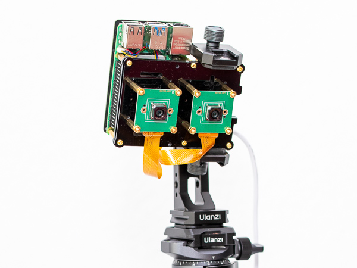
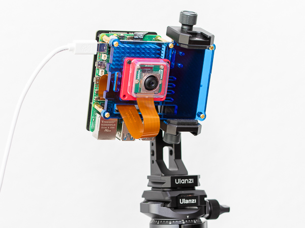

# Raspberry Pi 5 Cameras Stream and Capture

This repository contains scripts for streaming and capturing images using my Innomaker IMX708 and Arducam OwlSight camera modules on a Raspberry Pi 5. The script streams video over UDP to a client and allows capturing still images on the Pi.

<table align="center">
  <tr>
    <th>Inno Cam and RPi 5 on a tripod</th>
    <th>Ardu Cam and RPi 5 on a tripod</th>
  </tr>
  <tr>
    <td align="center">
      
    </td>
    <td align="center">
      
    </td>
  </tr>
</table>

## Platform

Streaming was tested on the following platforms:

### Raspberry Pi OS (Server)

- OS: Debian GNU/Linux bookworm 12.11 aarch64
- Host: Raspberry Pi 5 8GB
- Kernel: Linux 6.12.25+rpt-rpi-2712
- Shell: zsh 5.9

### macOS (Client)

- OS: macOS Sequoia 15.5 arm64
- Kernel: Darwin 24.5.0
- Shell: zsh 5.9

### Windows 11 (Client)

- OS: Windows 11 Pro x86_64
- Kernel: WIN32_NT 10.0.26100.4202 (24H2)
- Shell: Windows PowerShell 5.1.26100.4202

### Camera Modules

- InnoMaker IMX708 Auto focus - Sensor: IMX708 AF [4608x2592 10-bit RGGB]
- Arducam 64MP OwlSight Auto focus - Sensor: OV64A40 AF [9248x6944 10-bit]

## Features

* Flexible video streaming options:

  * Default: `rpicam-vid` (UDP).
  * Optional: `gst-launch-1.0` (GStreamer) via the `--gst` option.
  * Use a specific GStreamer binary with the `--gstver` option.
  * Choose the GStreamer protocol with `--gstprot` (`rtp` or `mpeg`).
  * Select the camera for streaming with `--streamcam` and for still images with `--stillcam`.
  * Configurable resolution (`--width`, `--height`) and framerate (`--framerate`) -  see [Tested Streaming Modes](#tested-streaming-modes).
  * Preview the video stream on the client using `ffplay` or GStreamer.
  * Press `c` to capture a still image with `rpicam-still`, saved locally on the Pi.
  * Press `r` to restart streaming.

When streaming with GStreamer, the `--gstver` option lets you select which
`gst-launch-1.0` binary to run. This is useful if you compiled multiple
versions as described in [README_CompileRPiGS.md](README_CompileRPiGS.md).

### Autofocus behavior (Arducam OwlSight)

The Arducam 64MP OwlSight camera module features an autofocus system that is **rather slow**. The autofocus is:

* Triggered **once at the beginning** of each streaming session.
* Triggered again when a **still image** is captured using `rpicam-still`.

Capturing a still image with this camera takes a **long time**, typically **6–10 seconds per image**.

To manually retrigger autofocus (e.g., after changing the object distance), simply **restart the stream** by pressing **`r`** during operation.

### Tested Streaming Modes

The following table lists tested camera streaming modes using GStreamer (`--gst`) with RTP or MPEG-TS, and `rpicam-vid` (`--rpicam`).

#### OV64A40

Autofocus is rather slow with the OV64A40.

| Streaming  | Result | WxH\@FPS           | Command                                                                                                             |
| ---------- | ------ | ------------------ | ------------------------------------------------------------------------------------------------------------------- |
| gst / rtp  | ✅      | 1280×720 @ 30 fps  | `capture --gst --gstprot rtp --clientip 192.168.2.101 --clientport 5000 --width 1280 --height 720 --framerate 30`   |
| gst / rtp  | ✅      | 1280×720 @ 60 fps  | `capture --gst --gstprot rtp --clientip 192.168.2.101 --clientport 5000 --width 1280 --height 720 --framerate 60`   |
| gst / rtp  | ✅      | 1920×1080 @ 30 fps | `capture --gst --gstprot rtp --clientip 192.168.2.101 --clientport 5000 --width 1920 --height 1080 --framerate 30`  |
| gst / rtp  | ✅      | 1920×1080 @ 60 fps | `capture --gst --gstprot rtp --clientip 192.168.2.101 --clientport 5000 --width 1920 --height 1080 --framerate 60`  |
| gst / rtp  | ✅      | 2304×1296 @ 15 fps | `capture --gst --gstprot rtp --clientip 192.168.2.101 --clientport 5000 --width 2304 --height 1296 --framerate 15`  |
| gst / rtp  | ✅      | 3840×2160 @ 15 fps | `capture --gst --gstprot rtp --clientip 192.168.2.101 --clientport 5000 --width 3840 --height 2160 --framerate 15`  |
| gst / mpeg | ✅      | 1280×720 @ 30 fps  | `capture --gst --gstprot mpeg --clientip 192.168.2.101 --clientport 5000 --width 1280 --height 720 --framerate 30`  |
| gst / mpeg | ✅      | 1280×720 @ 60 fps  | `capture --gst --gstprot mpeg --clientip 192.168.2.101 --clientport 5000 --width 1280 --height 720 --framerate 60`  |
| gst / mpeg | ✅      | 1920×1080 @ 30 fps | `capture --gst --gstprot mpeg --clientip 192.168.2.101 --clientport 5000 --width 1920 --height 1080 --framerate 30` |
| gst / mpeg | ❌      | 1920×1080 @ 60 fps | `capture --gst --gstprot mpeg --clientip 192.168.2.101 --clientport 5000 --width 1920 --height 1080 --framerate 60` |
| gst / mpeg | ❌      | 2304×1296 @ 15 fps | `capture --gst --gstprot mpeg --clientip 192.168.2.101 --clientport 5000 --width 2304 --height 1296 --framerate 15` |
| gst / mpeg | ❌      | 3840×2160 @ 15 fps | `capture --gst --gstprot mpeg --clientip 192.168.2.101 --clientport 5000 --width 3840 --height 2160 --framerate 15` |
| rpicam     | ⚠️ ²   | 1280×720 @ 25 fps  | `capture --rpicam --clientip 192.168.2.101 --clientport 5000 --width 1280 --height 720 --framerate 25`              |
| rpicam     | ⚠️ ²   | 720×480 @ 25 fps   | `capture --rpicam --clientip 192.168.2.101 --clientport 5000 --width 720 --height 480 --framerate 25`               |


#### IMX708AF

Autofocus is fast with the IMX708AF.

| Streaming  | Result | WxH\@FPS           | Command                                                                                                             |
| ---------- | ------ | ------------------ | ------------------------------------------------------------------------------------------------------------------- |
| gst / rtp  | ⚠️ ¹   | 1280×720 @ 30 fps  | `capture --gst --gstprot rtp --clientip 192.168.2.101 --clientport 5000 --width 1280 --height 720 --framerate 30`   |
| gst / rtp  | ⚠️ ¹   | 1280×720 @ 60 fps  | `capture --gst --gstprot rtp --clientip 192.168.2.101 --clientport 5000 --width 1280 --height 720 --framerate 60`   |
| gst / rtp  | ✅      | 1920×1080 @ 30 fps | `capture --gst --gstprot rtp --clientip 192.168.2.101 --clientport 5000 --width 1920 --height 1080 --framerate 30`  |
| gst / rtp  | ✅      | 1920×1080 @ 50 fps | `capture --gst --gstprot rtp --clientip 192.168.2.101 --clientport 5000 --width 1920 --height 1080 --framerate 50`  |
| gst / rtp  | ✅      | 2304×1296 @ 30 fps | `capture --gst --gstprot rtp --clientip 192.168.2.101 --clientport 5000 --width 2304 --height 1296 --framerate 30`  |
| gst / rtp  | ✅      | 2304×1296 @ 50 fps | `capture --gst --gstprot rtp --clientip 192.168.2.101 --clientport 5000 --width 2304 --height 1296 --framerate 50`  |
| gst / rtp  | ✅      | 3840×2160 @ 10 fps | `capture --gst --gstprot rtp --clientip 192.168.2.101 --clientport 5000 --width 3840 --height 2160 --framerate 10`  |
| gst / mpeg | ⚠️ ¹   | 1280×720 @ 30 fps  | `capture --gst --gstprot mpeg --clientip 192.168.2.101 --clientport 5000 --width 1280 --height 720 --framerate 30`  |
| gst / mpeg | ⚠️ ¹   | 1280×720 @ 60 fps  | `capture --gst --gstprot mpeg --clientip 192.168.2.101 --clientport 5000 --width 1280 --height 720 --framerate 60`  |
| gst / mpeg | ✅      | 1920×1080 @ 30 fps | `capture --gst --gstprot mpeg --clientip 192.168.2.101 --clientport 5000 --width 1920 --height 1080 --framerate 30` |
| gst / mpeg | ❌      | 1920×1080 @ 50 fps | `capture --gst --gstprot mpeg --clientip 192.168.2.101 --clientport 5000 --width 1920 --height 1080 --framerate 50` |
| gst / mpeg | ❌      | 2304×1296 @ 30 fps | `capture --gst --gstprot mpeg --clientip 192.168.2.101 --clientport 5000 --width 2304 --height 1296 --framerate 30` |
| gst / mpeg | ❌      | 3840×2160 @ 10 fps | `capture --gst --gstprot mpeg --clientip 192.168.2.101 --clientport 5000 --width 3840 --height 2160 --framerate 10` |
| rpicam     | ⚠️ ²   | 1280×720 @ 25 fps  | `capture --rpicam --clientip 192.168.2.101 --clientport 5000 --width 1280 --height 720 --framerate 25`              |
| rpicam     | ⚠️ ²   | 720×480 @ 25 fps   | `capture --rpicam --clientip 192.168.2.101 --clientport 5000 --width 720 --height 480 --framerate 25`               |


> **Note ¹:** Heavily cropped.
> **Note ²:** With `rpicam`, streaming delay increases over time.

## Requirements

* `zsh`
* `rpicam-apps`
* `gst-launch-1.0` (optional, if using GStreamer)
* `ffplay` or GStreamer (to view the video stream on the client)

## Installation

### Raspberry Pi OS

1. **Prepare `/boot/firmware/config.txt`**

   The following configuration worked for me on the Raspberry Pi 5:

   ```bash
   sudo nano /boot/firmware/config.txt
   ```

   #### Arducam OwlSight Cam

   When connected to **CAM/DISP 0**:

   ```bash
   # Arducam B0483 OwlSight 64MP OV64A40
   # Use CAM0 connector, disable camera auto-detection
   camera_auto_detect=0         # Disable automatic detection to define both cams manually
   dtoverlay=ov64a40,cam0,link-frequency=456000000
      ```

   #### Innocam IMX708AF Cam

   When connecting **two cameras** via **CAM/DISP 0 and CAM/DISP 1**:

   ```bash
   # Innocam IMX708AF (dual cam setup)
   camera_auto_detect=0         # Disable automatic detection to define both cams manually
   dtoverlay=imx708,cam0        # First camera on CAM/DISP 0
   dtoverlay=imx708,cam1        # Second camera on CAM/DISP 1
   ```

2. Update the system:
    ```bash
    sudo apt update && sudo apt upgrade
    ```

3. Install camera tools and GStreamer packages:
    ```bash
    sudo apt install rpicam-apps gstreamer1.0-libcamera gstreamer1.0-tools \
        gstreamer1.0-plugins-base gstreamer1.0-plugins-good \
        gstreamer1.0-plugins-bad gstreamer1.0-plugins-ugly gstreamer1.0-libav
    ```

   Alternatively you can compile GStreamer yourself from the git repository.
   See [README_CompileRPiGS.md](README_CompileRPiGS.md) for detailed instructions.

4. List cameras:

    ```bash
    rpicam-hello --list-cameras
    ```

    Example IMX708 cam:
    
    ```bash
    rpicam-hello --list
    Available cameras
    -----------------
    0 : imx708 [4608x2592 10-bit RGGB] (/base/axi/pcie@1000120000/rp1/i2c@88000/imx708@1a)
        Modes: 'SRGGB10_CSI2P' : 1536x864 [120.13 fps - (768, 432)/3072x1728 crop]
                                 2304x1296 [56.03 fps - (0, 0)/4608x2592 crop]
                                 4608x2592 [14.35 fps - (0, 0)/4608x2592 crop]
    ```
    
    Example OV64A40 cam:
    
    ```bash
    rpicam-hello --list
    Available cameras
    -----------------
    0 : ov64a40 [9248x6944 10-bit] (/base/axi/pcie@1000120000/rp1/i2c@88000/ov64a40@36)
        Modes: 'SBGGR10_CSI2P' : 1920x1080 [70.56 fps - (784, 1312)/7712x4352 crop]
                                 2312x1736 [32.24 fps - (0, 0)/9280x6976 crop]
                                 3840x2160 [19.40 fps - (784, 1312)/7712x4352 crop]
                                 4624x3472 [9.86 fps - (0, 0)/9280x6976 crop]
                                 8000x6000 [3.18 fps - (624, 472)/8048x6032 crop]
                                 9248x6944 [2.60 fps - (0, 0)/9280x6976 crop]
    ```


### macOS

1. Install Homebrew if needed:
    ```bash
    /bin/bash -c "$(curl -fsSL https://raw.githubusercontent.com/Homebrew/install/HEAD/install.sh)"
    ```

2. Install ffmpeg (provides ffplay) and GStreamer:
    ```bash
    brew install ffmpeg gstreamer gst-plugins-base gst-plugins-good gst-libav
    ```

### Windows 11

1. Install FFmpeg (includes `ffplay`) and GStreamer (includes `gst-launch-1.0`) via `winget`:

    ```powershell
    winget install --id=Gyan.FFmpeg --source=winget
    winget install GStreamer.GStreamer
    ```

2. Allow UDP port 5000 in Windows Firewall (this might already be done when ffplay starts for the first time).

## Streaming

On the client:

Depending on the streaming mode you selected in the script:

* **If using rpicam-vid (`--rpicam`):**

  On macOS (bash), use:

  ```bash
  ffplay -fflags nobuffer -flags low_delay udp://@:5000
  ```

  On Windows (PowerShell), use:

  ```powershell
  ffplay -fflags nobuffer -flags low_delay udp://0.0.0.0:5000
  ```

* **If using GStreamer (`--gst`):**

  By default RTP is used.

  On macOS (bash) for RTP:

  ```bash
  gst-launch-1.0 udpsrc port=5000 caps="application/x-rtp, media=video, encoding-name=H264, payload=96" ! \
      rtph264depay ! h264parse ! avdec_h264 ! videoconvert ! \
      videoflip method=vertical-flip ! videobalance saturation=0.0 ! autovideosink sync=false
  ```

  For MPEG-TS (`--gstprot mpeg`):

  ```bash
  gst-launch-1.0 udpsrc port=5000 ! tsdemux ! h264parse ! avdec_h264 ! videoconvert ! \
      videoflip method=vertical-flip ! videobalance saturation=0.0 ! autovideosink sync=false
  ```

  On Windows (PowerShell) for RTP:

  ```powershell
  & "C:\Program Files\gstreamer\1.0\msvc_x86_64\bin\gst-launch-1.0.exe" `
    udpsrc port=5000 caps="application/x-rtp, media=video, encoding-name=H264, payload=96" `
    ! rtph264depay ! h264parse ! avdec_h264 ! videoconvert `
    ! videoflip method=vertical-flip ! videobalance saturation=0.0 `
    ! autovideosink sync=false
  ```

  For MPEG-TS:

  ```powershell
  & "C:\Program Files\gstreamer\1.0\msvc_x86_64\bin\gst-launch-1.0.exe" `
    udpsrc port=5000 `
    ! tsdemux ! h264parse ! avdec_h264 ! videoconvert `
    ! videoflip method=vertical-flip ! videobalance saturation=0.0 `
    ! autovideosink sync=false
  ```

  On first launch, Windows 11 may prompt you to allow network access for the application. You may need administrator privileges to allow incoming connections on the specified port.


On the Server (Raspberry Pi):

```bash
git clone https://github.com/simas2024/RPiTools.git
```

```bash
cd RPiTools
chmod +x zsh/innocam/capture01.zsh
```

Navigate to the directory where the repository was cloned, and optionally create a global symlink:

```bash
sudo ln -s "$PWD/zsh/innocam/capture01.zsh" /usr/local/bin/capture
```

Alternatively, run it directly from the repository directory:

```bash
./zsh/innocam/capture01.zsh
```

To use a self-compiled GStreamer version:

```bash
./zsh/innocam/capture01.zsh --gst --gstver /opt/gstreamer/1.26.2/bin/gst-launch-1.0 --clientip 192.168.0.100 --clientport 6000
```

Show the help to choose the right options and values:

```bash
capture --help
```

or

```bash
./zsh/innocam/capture01.zsh --help
```

Press `c` to capture a still image (saved on the Pi).

Press `r` to restart the streaming.

Press `s` to stop the stream and exit the script.

## References

### Documentation
 
- [Raspberry Pi Camera Software Documentation](https://www.raspberrypi.com/documentation/computers/camera_software.html)
- [GStreamer Official Documentation](https://gstreamer.freedesktop.org/documentation/)
- [FFmpeg Tools Documentation (ffplay)](https://ffmpeg.org/ffplay.html)
- [Innomaker Camera Doc](https://github.com/INNO-MAKER/cam-imx708af)
- [ArduCam Camera Doc](https://docs.arducam.com/Raspberry-Pi-Camera/Native-camera/64MP-OV64A40)
- [ArduCam Camera Product Brief](https://blog.arducam.com/downloads/datasheet/Arducam_64mp_ov64a40_product_brief.pdf)

### Source

- [GStreamer Source](https://gitlab.freedesktop.org/gstreamer/gstreamer.git)
 

